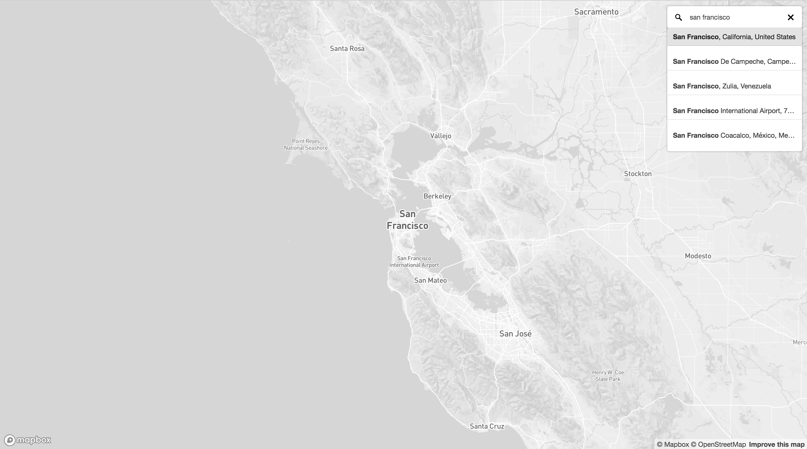

# react-map-gl-geocoder

React wrapper for mapbox-gl-geocoder for use with react-map-gl.

[](https://www.npmjs.com/package/react-map-gl-geocoder) [](https://dashboard.cypress.io/projects/etguoj/runs)


## Demos
* Simple Example - https://codesandbox.io/s/l7p179qr6m
* Ignore Map Events Example - https://codesandbox.io/s/react-map-gl-geocoder-using-containerref-to-ignore-events-rewdh

## Installation
npm
```
$ npm install react-map-gl-geocoder
```

or

Yarn
```
$ yarn add react-map-gl-geocoder
```

## Styling
Import:
```js
import 'react-map-gl-geocoder/dist/mapbox-gl-geocoder.css'
```

or

Link tag in header:
```html
<link href='https://api.mapbox.com/mapbox-gl-js/plugins/mapbox-gl-geocoder/v4.2.0/mapbox-gl-geocoder.css' rel='stylesheet' />
```


## Props
Only `mapRef` and `mapboxApiAccessToken` are required. 

All non-primitive prop values besides `mapRef` and `containerRef` should be memoized.

| Name | Type | Default | Description |
|--- | --- | --- | --- |
| mapRef | Object | | Ref for react-map-gl map component.
| containerRef | Object | | This can be used to place the geocoder outside of the map. The `position` prop is ignored if this is passed in. Example: https://codesandbox.io/s/v0m14q5rly
| onViewportChange | Function | () => {} | Is passed updated viewport values after executing a query.
| mapboxApiAccessToken | String | | https://www.mapbox.com/
| inputValue | String | | Sets the search input value
| origin | String | "https://api.mapbox.com" | Use to set a custom API origin.
| zoom | Number | 16 | On geocoded result what zoom level should the map animate to when a `bbox` isn't found in the response. If a `bbox` is found the map will fit to the `bbox`.
| placeholder | String | "Search" | Override the default placeholder attribute value.
| proximity | Object | | A proximity argument: this is a geographical point given as an object with latitude and longitude properties. Search results closer to this point will be given higher priority.
| trackProximity | Boolean | false | If true, the geocoder proximity will automatically update based on the map view.
| collapsed | Boolean | false | If true, the geocoder control will collapse until hovered or in focus.
| clearAndBlurOnEsc | Boolean | false | If true, the geocoder control will clear it's contents and blur when user presses the escape key.
| clearOnBlur | Boolean | false | If true, the geocoder control will clear its value when the input blurs.
| bbox | Array | | A bounding box argument: this is a bounding box given as an array in the format [minX, minY, maxX, maxY]. Search results will be limited to the bounding box.
| types | String | | A comma seperated list of types that filter results to match those specified. See <https://www.mapbox.com/developers/api/geocoding/#filter-type> for available types.
| countries | String | | A comma separated list of country codes to limit results to specified country or countries.
| minLength | Number | 2 | Minimum number of characters to enter before results are shown.
| limit | Number | 5 | Maximum number of results to show.
| language | String | | Specify the language to use for response text and query result weighting. Options are IETF language tags comprised of a mandatory ISO 639-1 language code and optionally one or more IETF subtags for country or script. More than one value can also be specified, separated by commas.
| filter | Function | | A function which accepts a Feature in the [Carmen GeoJSON](https://github.com/mapbox/carmen/blob/master/carmen-geojson.md) format to filter out results from the Geocoding API response before they are included in the suggestions list. Return `true` to keep the item, `false` otherwise.
| localGeocoder | Function | | A function accepting the query string which performs local geocoding to supplement results from the Mapbox Geocoding API. Expected to return an Array of GeoJSON Features in the [Carmen GeoJSON](https://github.com/mapbox/carmen/blob/master/carmen-geojson.md) format.
| reverseGeocode | Boolean | false | Enable reverse geocoding. Defaults to false. Expects coordinates to be lat, lon.
| enableEventLogging | Boolean | true | Allow Mapbox to collect anonymous usage statistics from the plugin.
| marker | Boolean or Object | true | If true, a [Marker](https://docs.mapbox.com/mapbox-gl-js/api/#marker) will be added to the map at the location of the user-selected result using a default set of Marker options. If the value is an object, the marker will be constructed using these options. If false, no marker will be added to the map.
| render | Function | | A function that specifies how the results should be rendered in the dropdown menu. Accepts a single Carmen GeoJSON object as input and return a string. Any html in the returned string will be rendered. Uses mapbox-gl-geocoder's default rendering if no function provided.  
| position | String | "top-right" | Position on the map to which the geocoder control will be added. Valid values are `"top-left"`, `"top-right"`, `"bottom-left"`, and `"bottom-right"`.
| onInit | Function | () => {} | Is passed Mapbox geocoder instance as param and is executed after Mapbox geocoder is initialized.
| onClear | Function | () => {} | Executed when the input is cleared.
| onLoading | Function | () => {} | Is passed `{ query }` as a param and is executed when the geocoder is looking up a query.
| onResults | Function | () => {} | Is passed `{ results }` as a param and is executed when the geocoder returns a response.
| onResult | Function | () => {} | Is passed `{ result }` as a param and is executed when the geocoder input is set.
| onError | Function | () => {} | Is passed `{ error }` as a param and is executed when an error occurs with the geocoder.
  
  
  
## Examples

### Simple Example
```js
import 'mapbox-gl/dist/mapbox-gl.css'
import 'react-map-gl-geocoder/dist/mapbox-gl-geocoder.css'
import React, { useState, useRef, useCallback } from 'react'
import MapGL from 'react-map-gl'
import Geocoder from 'react-map-gl-geocoder'

// Ways to set Mapbox token: https://uber.github.io/react-map-gl/#/Documentation/getting-started/about-mapbox-tokens
const MAPBOX_TOKEN = 'REPLACE_WITH_YOUR_MAPBOX_TOKEN'

const Example = () => {
  const [viewport, setViewport] = useState({
    latitude: 37.7577,
    longitude: -122.4376,
    zoom: 8
  });
  const mapRef = useRef();
  const handleViewportChange = useCallback(
    (newViewport) => setViewport(newViewport),
    []
  );

  // if you are happy with Geocoder default settings, you can just use handleViewportChange directly
  const handleGeocoderViewportChange = useCallback(
    (newViewport) => {
      const geocoderDefaultOverrides = { transitionDuration: 1000 };

      return handleViewportChange({
        ...newViewport,
        ...geocoderDefaultOverrides
      });
    },
    []
  );

  return (
    <div style={{ height: "100vh" }}>
      <MapGL
        ref={mapRef}
        {...viewport}
        width="100%"
        height="100%"
        onViewportChange={handleViewportChange}
        mapboxApiAccessToken={MAPBOX_TOKEN}
      >
        <Geocoder
          mapRef={mapRef}
          onViewportChange={handleGeocoderViewportChange}
          mapboxApiAccessToken={MAPBOX_TOKEN}
          position="top-left"
        />
      </MapGL>
    </div>
  );
};

export default Example
```

### Ignore Map Events Example
You can use the `containerRef` prop to place the `Geocoder` component outside of the `MapGL` component to avoid propagating the mouse events to the `MapGL` component. You can use CSS to position it over the map as shown in this example.
```js
import 'mapbox-gl/dist/mapbox-gl.css'
import 'react-map-gl-geocoder/dist/mapbox-gl-geocoder.css'
import React, { useState, useRef, useCallback } from 'react'
import MapGL from 'react-map-gl'
import Geocoder from 'react-map-gl-geocoder'

// Ways to set Mapbox token: https://uber.github.io/react-map-gl/#/Documentation/getting-started/about-mapbox-tokens
const MAPBOX_TOKEN = 'REPLACE_WITH_YOUR_MAPBOX_TOKEN'

const Example = () => {
  const [viewport, setViewport] = useState({
    latitude: 37.7577,
    longitude: -122.4376,
    zoom: 8,
  });
  const geocoderContainerRef = useRef();
  const mapRef = useRef();
  const handleViewportChange = useCallback(
    (newViewport) => setViewport(newViewport),
    []
  );

  return (
    <div style={{ height: "100vh" }}>
      <div
        ref={geocoderContainerRef}
        style={{ position: "absolute", top: 20, left: 20, zIndex: 1 }}
      />
      <MapGL
        ref={mapRef}
        {...viewport}
        width="100%"
        height="100%"
        onViewportChange={handleViewportChange}
        mapboxApiAccessToken={MAPBOX_TOKEN}
      >
        <Geocoder
          mapRef={mapRef}
          containerRef={geocoderContainerRef}
          onViewportChange={handleViewportChange}
          mapboxApiAccessToken={MAPBOX_TOKEN}
          position="top-left"
        />
      </MapGL>
    </div>
  );
};
```

## Sample Screenshot

